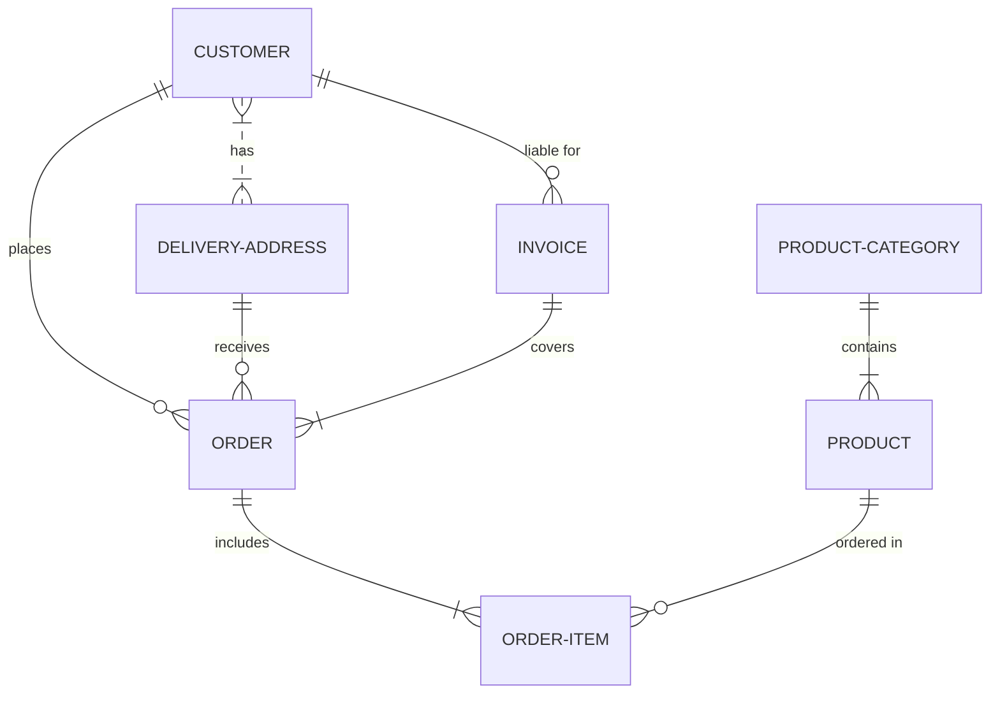

# Proyecto de Estudio!
    
**Estructura del documento principal:**

# PRESENTACIÓN Proyecto Gestión Ventas

**Asignatura**: Bases de Datos I (FaCENA-UNNE)

**Integrantes**:
 - Ojeda, Lucas Fernando DNI 45.845.469.
 -Barrios, Cesar Pietro DNI 44.542.063
 - In tincidunt augue sed molestie malesuada.

**Año**: 2024

## CAPÍTULO I: INTRODUCCIÓN

### Caso de estudio

Sistema de Gestión de ventas para un supermercado. 

### Definición o planteamiento del problema

El objetivo de estudio es realizar ventas sin perder el control de lo que se vende, a quién se vende, cómo se vende, además de saber quien lo está vendiendo. Dentro de la problemática, se incluye los montos y cantidades de productos, los cuáles tienen un proveedor y una categoria.
¿Por qué es necesario un sistema de gestión de ventas? El software se hace necesario para un supermercado para que este mismo genere rentabilidad, saber que el comercio obtiene ganancias al vender sus productos y se tiene conocimiento de los productos que aún están disponibles para su venta. Al existir diversa cantidad de productos con nombres similares, se debe poder encontrar un producto con un identificador (id).
Existen distintos medios de pagos en la actualidad, y no todos utilizan el mismo método. Por ejemplo, Argentina realiza pagos con billeteras digitales en un 31% de las transacciones.

###  Objetivo del Trabajo Práctico.
El trabajo fue realizo para comprender la organización de los datos en un sistemas de ventas, gracias a esto se podra observar las entidades que realizan las compras y ventas dentro del sistema y los elementos que operan. Ademas de poder visualizar un sistema de gestion de roles y tipos de usuario, tipos de categorias de productos y proveedores de los mismos.

## CAPITULO II: MARCO CONCEPTUAL O REFERENCIAL

**TEMA 1 " ---- "** 
El sistema se basará en un software que cubre necesidades básicas de un sistemade ventas que está en constante movimiento, donde se debe actualizar los precios y el stock, así como registrar productos nuevos para que estos mismos puedan ser vendidos. También se piensa en el sistema de ventas donde se recibe el importe, el cuál puede ser abonado usando diferentes medios de pagos. Se registran los datos del cliente para la factura final. Los usuarios capaces de utilizar el sistema tienen distintos roles como puede ser un vendedor o un administrador.
Se usaran las formas normalizadas a la hora de diseñar bases de datos y convenciones de nomenclaturas que seran especificadas mas adelante en el trabajo.

...

## CAPÍTULO III: METODOLOGÍA SEGUIDA 

En este capítulo se presenta el plan seguido o las acciones llevadas a cabo para realizar el trabajo, 
las dificultades encontradas, y cualquier otra información que proporcione la idea de cómo se 
realizó el trabajo.

 **a) Cómo se realizó el Trabajo Práctico**
El trabajo se realizo coordinandonos con un grupo de WhatsApp, primero se realizo el modelo relacional a partir del cual se realizo el documento, luego se realizo el diccionario de datos.

 **b) Herramientas (Instrumentos y procedimientos)**
El modelo relacional se realizo usando ERDPLUS siguiendo las convenciones de la catedra en el primer parcial y siguiendo las reglas relacionales de normalizacion de bases de datos. 

## CAPÍTULO IV: DESARROLLO DEL TEMA / PRESENTACIÓN DE RESULTADOS 

### Diagrama conceptual (opcional)
Ejemplo usando Live Editor https://mermaid.js.org/ (ejemplo opcional)

### Diagrama relacional

### Diccionario de datos

Acceso al documento [PDF](doc/diccionario_datos.pdf) del diccionario de datos.

### Desarrollo TEMA 1 "----"

Fusce auctor finibus lectus, in aliquam orci fermentum id. Fusce sagittis lacus ante, et sodales eros porta interdum. Donec sed lacus et eros condimentum posuere. 

> Acceder a la siguiente carpeta para la descripción completa del tema [scripts-> tema_1](script/tema01_nombre_tema)

### Desarrollo TEMA 2 "----"

Proin aliquet mauris id ex venenatis, eget fermentum lectus malesuada. Maecenas a purus arcu. Etiam pellentesque tempor dictum. 

> Acceder a la siguiente carpeta para la descripción completa del tema [scripts-> tema_2](script/tema02_nombre_tema)

... 

## CAPÍTULO V: CONCLUSIONES
------

## BIBLIOGRAFÍA DE CONSULTA

 1. Soledad Navarro, 01/05/2024, Cómo pagan los argentinos: ¿Prefieren el efectivo, las tarjetas de crédito o débito, o las billeteras virtuales?, Clarín
 2. List item
 3. List item
 4. List item
 5. List item

